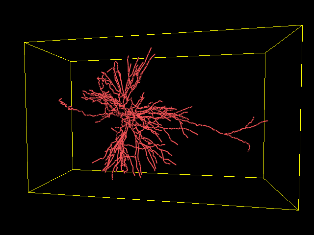

======
Actors
======

Fos includes various actors (visualization objects) for visualization.
They expose an easy interface for creation, usually using Numpy arrays.
Two classes of actors are defined:

Static actors
  For static structures that do not evolve in time.
  
Dynamic actors
  One, or more parameters can have a time dimension, making the actor
  evolving dynamically.

-------------
Static actors
-------------

AttributeNetwork
````````````````
.. image:: static/network_random.png

ConnectedSlices
```````````````
.. image:: static/connectedslices.png

Surface
```````
.. image:: static/surface.png

InteractiveCurves
`````````````````
.. image:: static/interactivecurves.png

NeuronRegion
````````````


SphereCloud
```````````
.. image:: static/spherecloud.png


--------------
Dynamic actors
--------------

DynamicNetwork
``````````````
.. image:: static/network_dynamic.png
